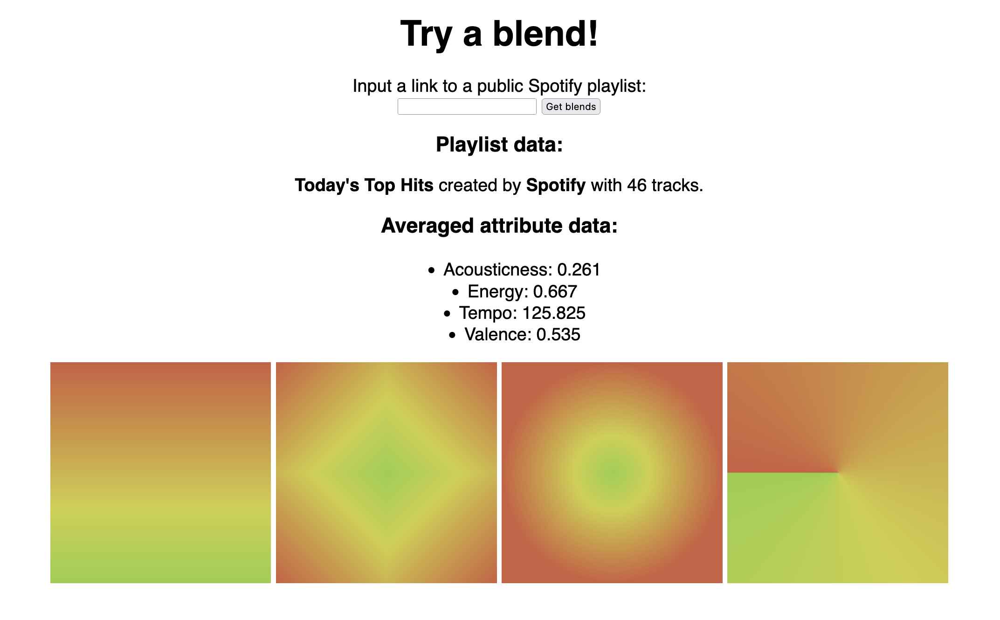

# PlaylistBlender

PlaylistBlender is a Flask web application that generates appealing gradient images reflecting the mood and feel of a Spotify playlist. It is not particularly scientific or complex, but it's a little bit cool. And the resulting images are perfectly formatted for use as playlist cover art!

### Capabilities

- allows user to submit a link to any public Spotify playlist
- produces vertical, diamond, radial, and conic gradients

### Limitations

- private playlists don't work (no auth)
- can't interpret albums/songs/etc.
- audio feature -> color values are hard-coded

### In the future...

- interpret any public Spotify item (albums/songs/etc.)
- make even cooler gradients
- tidy up the UI
- get a demo site up and running